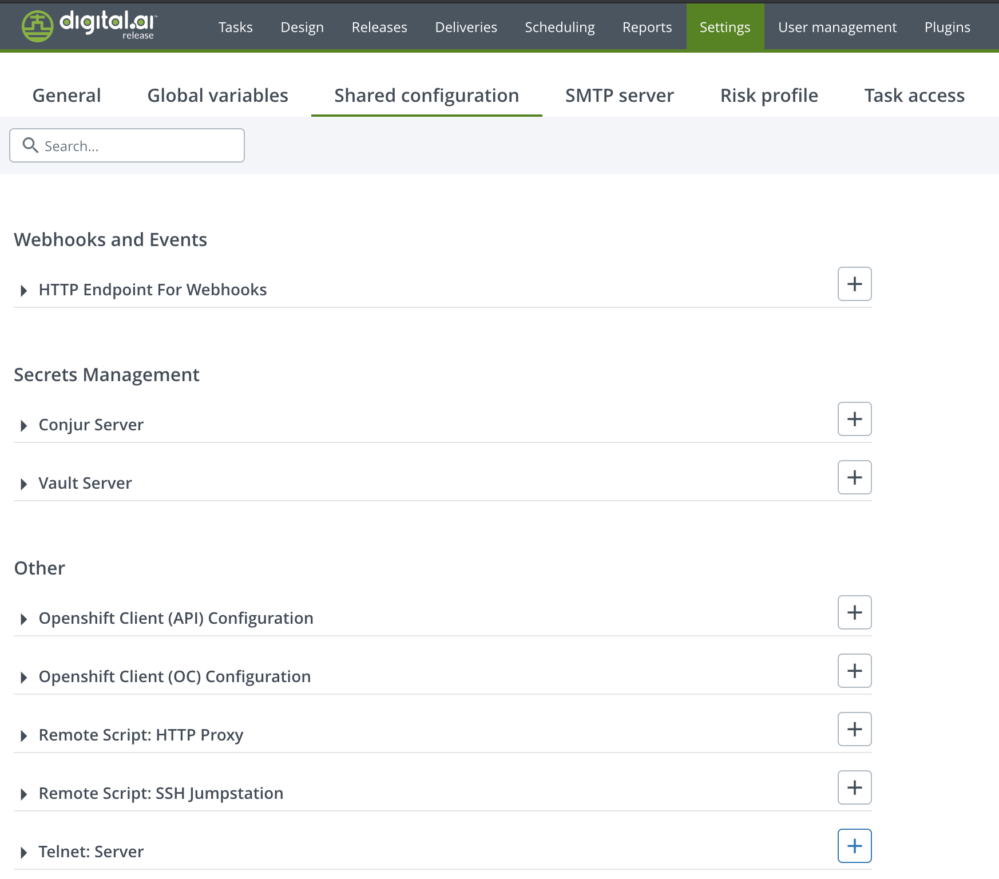
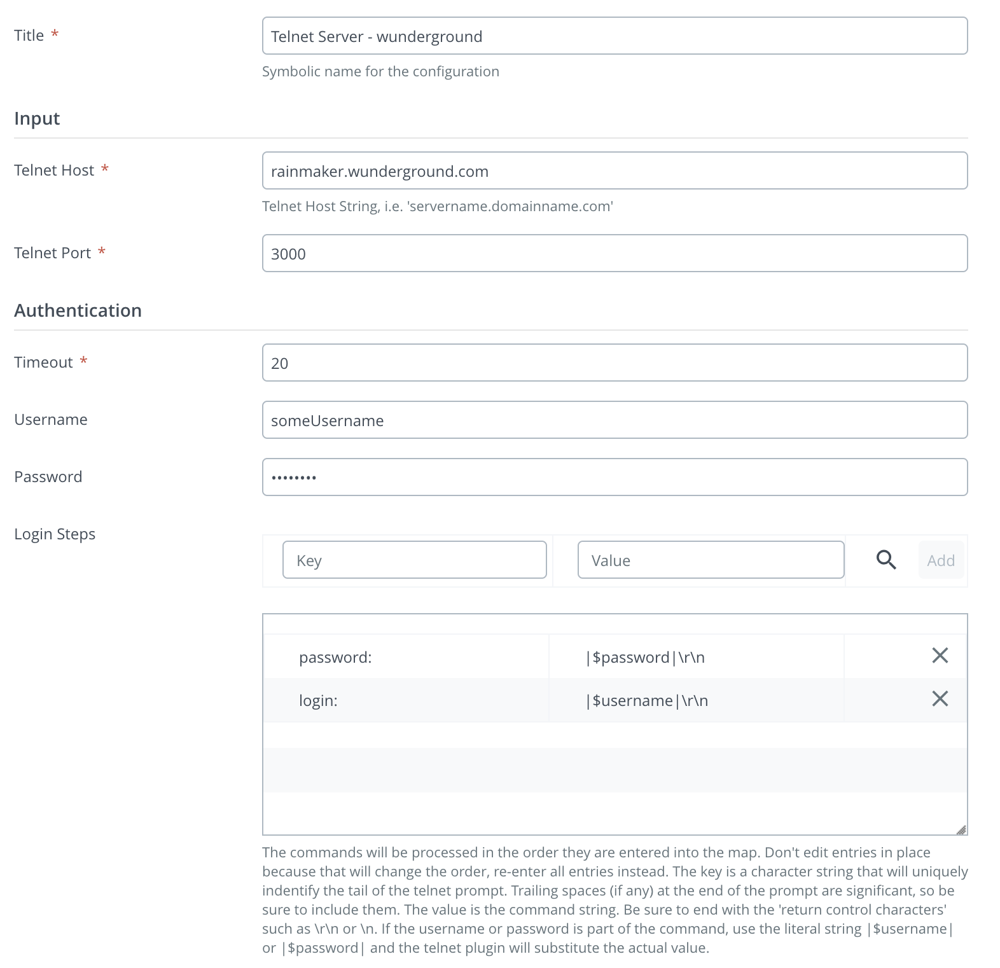
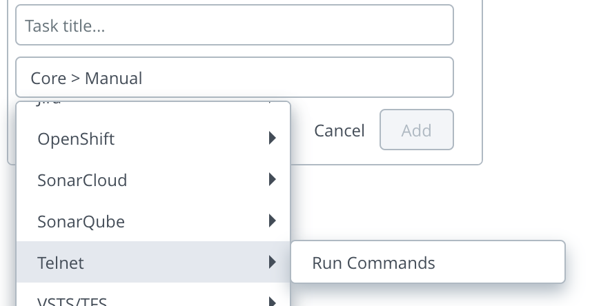
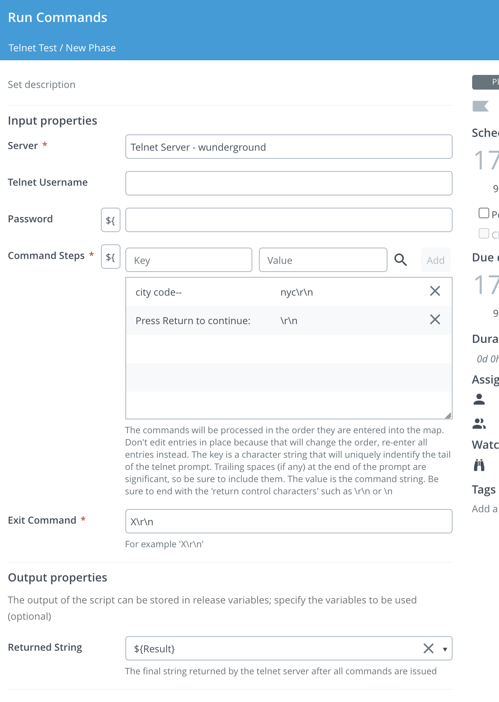

# XL Release Telnet Plugin v0.1.0

[![Build Status][xlr-telnet-plugin-travis-image]][xlr-telnet-plugin-travis-url]
[![License: MIT][xlr-telnet-plugin-license-image]][xlr-telnet-plugin-license-url]
![Github All Releases][xlr-telnet-plugin-downloads-image]

[xlr-telnet-plugin-travis-image]: https://travis-ci.org/xebialabs-community/xlr-telnet-plugin.svg?branch=master
[xlr-telnet-plugin-travis-url]: https://travis-ci.org/xebialabs-community/xlr-telnet-plugin
[xlr-telnet-plugin-license-image]: https://img.shields.io/badge/License-MIT-yellow.svg
[xlr-telnet-plugin-license-url]: https://opensource.org/licenses/MIT
[xlr-telnet-plugin-downloads-image]: https://img.shields.io/github/downloads/xebialabs-community/xlr-telnet-plugin/total.svg

## Preface

**This is a pre-release plugin that is still undergoing development.**

This is a 'See It Work' plugin, meaning it has been enhanced to include functionality that makes it easy to spin up and configure a dockerized version of the XebiaLabs platform with this plugin installed. Using the provided test data, you can then try out the plugin features. This is useful for familiarizing yourself with the plugin functionality, for demonstrations, testing and for further plugin development.

This document describes the functionality provided by the XL Release Telnet plugin.
  
See the [XL Release reference manual](https://docs.xebialabs.com/xl-release) for background information on XL Release and release automation concepts.  

## Overview

This plugin provides a way to run simple command sequences on a telnet server. At this point, its capabilities are quite unsophisticated.

The plugin adds a new server type named 'Telnet Server'. Currently, there is a single new task type name 'Run Commands'.

## Requirements

*XL Release version 9.0+
*This plugin has been tested on version 9.7 as well

## Installation

* Copy the latest JAR file from the [releases page](https://github.com/xebialabs-community/xlr-telnet-plugin/releases) into the `XL_RELEASE_SERVER/plugins/__local__` directory.
* Restart the XL Release server.

## Usage

### Configure the Telnet Server



Add a new Telnet Server on the Settings -> Shared Configration page.

To configure the server:

1. Give the server a unique name
2. Enter the Telnet Host address
3. Enter the Telnet Host port
4. Modify the timeout, if desired
5. If a login is necessary, enter the username and password
6. Enter the command steps for login.
   1. The commands will be processed in the order they are entered into the map. Don't edit entries in place because that will change the order, re-enter all entries instead.
   2. The Key is a character string that will uniquely identify the tail of the telnet prompt. Trailing spaces, if any, are significant, so be sure to include them.
   3. The value is the command string. Be sure to end the command with the 'return control characters' such as \r\n or \n.
   4. If the username or password is part of the command, use the literal string |$username| or |$password| and the telnet plugin will subsitute the actual value. 



### Configure the Telnet 'Run Commands' Task



1. Choose a Telnet Server from the drop down list
2. If you need to use a different username or password than that entered during the Telnet Server configuration, enter it here.
3. Enter the sequence of command steps.
   1. The commands will be processed in the order they are entered into the map. Don't edit entries in place because that will change the order, re-enter all entries instead. 
   2. The key is a character string that will uniquely identify the tail of the telnet prompt. Trailing spaces (if any) at the end of the prompt are significant, so be sure to include them.
   3. The value is the command string. Be sure to end with the 'return control characters' such as \r\n or \n" />



XXXX### Example - Running commands against the publicly available wunderground weather serverXXX

XXXXXThis server does not require a login:


### To run demo or dev version (set up docker container for XLR and then import configuration)

Download this github project to a local directory.

1. You will need to have Docker  and Docker Compose installed.
2. The XL-Release image will use the community license. Note that by using this license, you are accepting the [End User License Agreement](https://dist.xebialabs.com/public/legal/eula-artifacts-v10.txt). If you prefer to use your own license, modify the docker-compose.yml file.
3. Plugin log files will be written to <plugin source code directory>/build/reports/tests/log directory
4. XL Release will run on the [localhost port 15516](http://localhost:15516/).
5. The XL Release username / password is admin / admin.

Before running the demo, be sure to create the plugin jar by opening a terminal, cd into the plugin source code directory, and run

```bash
./gradlew clean build
```

To run the dev/demo mode, open a terminal, cd into the src/test/resources/docker directory of the plugin code and run:

```bash
docker-compose up
```

After XLR starts up:

1. log in using the admin / admin credentials
2. Create a telnet server for the publicly available wunderground weather server - use the values found in this file: src/test/resources/docker/initialize/data/server-config.json. This telnet server does not need a login.
3. Use the XLR 'Import Template' feature to import the template found in the src/test/resources/docker/initialize/data directory. You can then create a release and run the test example.

To shut down and remove the docker containers, in the src/test/resources/docker/initialize/data directory, run

```bash
docker-compose down
```

## References
